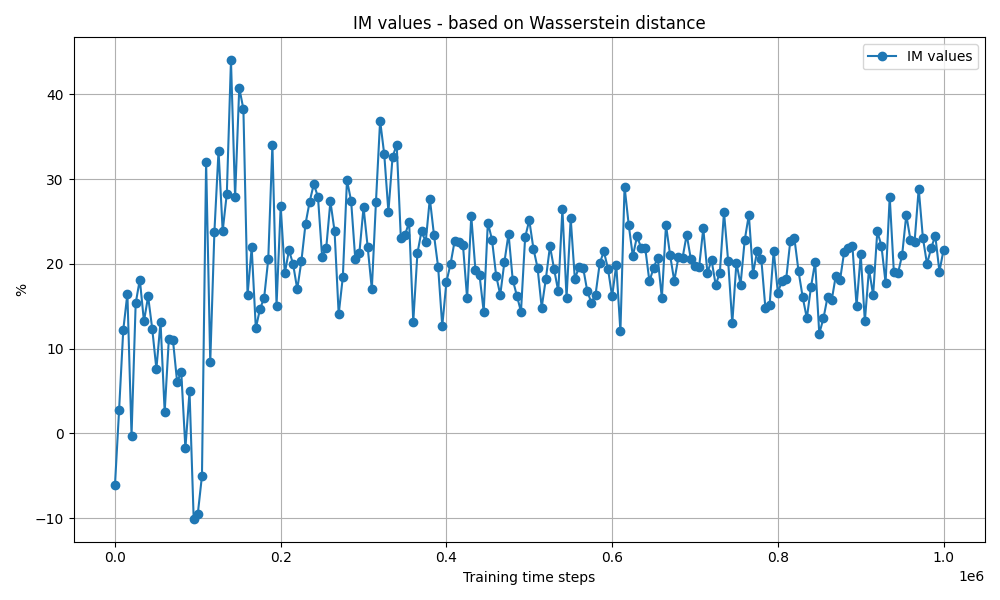

# AudioGenRL

## General description

Musicians, especially beginners, tend to sometimes miss and hit a wrong note. Unfortunately, the closest 
note on the instrument to the intended one, will probably sound especially bad if played instead.

The goal is to create an algorithm that receives audio with such errors and outputs a corrected version, 
without those severe errors, keeping as much of the input audio dynamics as possible.

## Formulating the problem

A natural formulation of the problem to RL settings will be defining a DDP. States correspond to a beat of song, 
namely a 4 item tuple, each one describes what is played in the corresponding 1/16. Actions are isomorphic to the 
possible next state space. Reward function must be learned using training dataset. 

## The dataset

As a challenge, the dataset contained only 1 piano piece. From that piece, a few thousands of possible 
current state - next state transitions were extracted, the reward function was learned by averaging the 
observed transitions. 

## Chosen RL algorithm

It's PPO. Offline/off-policy learning is irrelevant for the current problem, so SAC and similar algorithms doesn't 
have a inherited advantage over PPO. PPO is knows for its robustness and therefore it was a good candidate for the problem.
PPO was compared to SARSA, and its robustness compared to SARSA is distinct.

## Error correction

For the discussed case, there is only one assumption on the errors: the timing of the notes is correct. 
Namely, there are no restrictions on the size of the errors or their amount. Therefore any kind of 
scale/chords estimation is irrelevant.

Solution approach: 
1. Generate a sequence of notes using a GenAI algorithm based on RL.
2. Inject the notes to the input, replacing all the notes with the generated ones.

This approach suggest a very aggressive error correction. It will be useful if there are indeed 
many errors in the audio, but if there are not so many, softer correction such as scale estimation may be better 
in the sense that it will allow to preserve some of the user's original notes. 

## Results

To measure the correction quality, ground truth songs were taken, injected with errors and corrected again and again 
using the algorithm in different points during its training. The idea is to see the improvement of it during the training, 
revealing if the algorithm actually learns valuable behaviour. 

To measure the improvement, 2 Wasserstein distances are compared. Distance between the ground truth and the output of the untrained algorithm, 
and distance between the ground truth and the output of the different trained algorithm stages. 

The difference between those distances (normalized, in %) is called IM measure. Here is a polt of it:

since stabilizing, the average IM is around 20%.

## Conclusions

1. The describe algorithm significantly improves the audio quality.

2. The metric based on Wasserstein distance corresponds to that quality improvement, suggesting it may be a good 
quantitative measure for correction quality. 

